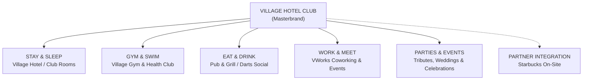
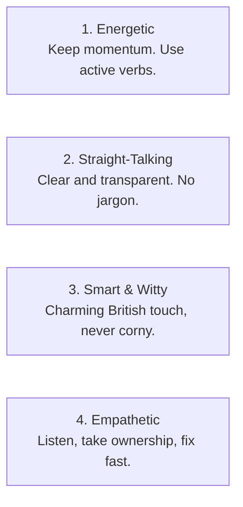

# Village Hotel Club: Official Brand Guidelines & Identity Manual

> **Version:** 2.4  
> **Brand Classification:** Lifestyle Hospitality, Wellness & Social Hub  
> **Masterbrand:** Village Hotel Club (Village Hotels)  
> **Owner/Backing:** Blackstone Real Estate  

---

## 1. Brand Strategy & Essence

### 1.1 Brand Purpose & Mission
At Village Hotel Club, we do not believe in ordinary, sterile overnight stops. Our purpose is to create **the ultimate vibrant neighborhood hub**—an energetic destination where guests and locals come together to **Stay, Work, Workout, Eat, and Celebrate** under one roof.

```
                    ┌─────────────────────────────────────────┐
                    │               BRAND MOTTO               │
                    │   "EVERYTHING UNDER ONE ROOF. NO FUSS." │
                    └─────────────────────────────────────────┘
```

### 1.2 Brand Positioning: The "All-Under-One-Roof" Lifestyle Hub
Unlike traditional regional hotels that treat dining, gyms, and conference rooms as passive support amenities, Village Hotels manages each component as a premier, high-energy standalone offering:
* **For Hotel Residents:** An elevated, tech-forward, resort-style stay with immediate access to massive wellness and dining amenities.
* **For Local Members & Communities:** The heartbeat of the local town—their daily fitness club, co-working office, weekend match-day sports bar, and celebration venue.

### 1.3 Core Brand Values

| Value | Meaning in Practice |
| :--- | :--- |
| **Energetic & Uplifting** | We infuse vitality, momentum, and positivity into every guest touchpoint—from our high-tempo gym playlists to our bustling grill. |
| **Straight-Talking & Unpretentious** | No corporate jargon or stiff hospitality protocols. We are genuine, welcoming, warm, and distinctly British. |
| **Smart & Connected** | We harness streamlined technology (app check-in, keyless entry, smart room tech) to eliminate friction, giving guests freedom and control. |
| **Inclusive & Social** | We are a democratic brand. Whether you are an elite athlete, a corporate nomad, a family on a road trip, or a local catching the football match, you belong here. |

### 1.4 Brand Archetype: The "Vibrant Host" (Jester + Everyman + Creator)
Village Hotels is the fun, approachable, energetic host of the town. We never take ourselves too seriously, but we take hospitality, fitness, and entertainment very seriously.

---

## 2. Brand Architecture & Sub-Brands

Village Hotels operates a **Branded House** architecture with strong, specialized pillar sub-brands. The masterbrand logo anchors all identities, while individual sub-brands carry distinct accent colors and descriptive lockups.



### Sub-Brand Hierarchy & Roles
1. **Village Hotel (Stay & Sleep):** The core accommodation brand. Encompasses Standard Rooms, Club Rooms (with premium perks), and Family Suites.
2. **Village Gym (Gym & Swim):** High-volume commercial fitness clubs featuring 25m swimming pools, techno-gym equipment, spin studios, steam/saunas, and member group classes.
3. **Village Pub & Grill (Eat & Drink):** A modern British gastro-sports pub showing live sports, serving hearty burgers, grills, craft beers, and weekend bottomless brunches.
4. **VWorks (Work & Meet):** Dedicated, flexible co-working spaces, private meeting rooms, hot desks, and tech-equipped training suites for business travellers and local remote workers.
5. **Village Events (Parties & Celebrations):** Large-scale banqueting suites hosting tribute nights, wedding receptions, Christmas parties, and private milestone celebrations.
6. **Licensed Partnership (Starbucks):** Integrated into every lobby as the recognized morning coffee and pastry destination.

---

## 3. Logo System & Usage Rules

### 3.1 Primary Masterbrand Logo
The Village Hotel Club logo consists of the bold, geometric, uppercase wordmark **VILLAGE** balanced with the secondary descriptor **HOTEL CLUB**.

* **Primary Masterbrand Lockup:** The word "VILLAGE" set in bold grotesque lettering with the subtitle "HOTEL CLUB" centered beneath.
* **The Icon / Monogram Mark:** The stylized uppercase **"V"** integrated into digital app icons, social avatars, and favicon marks.

### 3.2 Clearspace & Minimum Sizing

```
        ┌────────────────────────────────────────────────────────┐
        │  [X]                                              [X]  │
        │       ┌──────────────────────────────────────┐         │
        │       │             V I L L A G E            │         │
        │  [X]  │              HOTEL CLUB              │   [X]   │
        │       └──────────────────────────────────────┘         │
        │  [X]                                              [X]  │
        └────────────────────────────────────────────────────────┘
```

* **Clearspace Rule:** The minimum clearspace surrounding the logo must equal **"X"**, where **X = the height of the letter "V" in VILLAGE**. No graphics, text, borders, or photo elements may intrude into this zone.
* **Minimum Digital Size:** 120 pixels wide (ensures legibility of "HOTEL CLUB").
* **Minimum Print Size:** 35 mm wide.

### 3.3 Logo Color Variations
1. **Primary White (Negative):** Used on Pitch Black, Dark Slate, or rich photography backgrounds (Official default for hotel signage and website header).
2. **Primary Black (Positive):** Used on pure white, light neutral backgrounds, or high-key print documents.
3. **Blaze Orange Accent Lockup:** Used selectively on marketing hero banners and promotional launch collateral.

### 3.4 Unacceptable Usages (Don'ts)
* ❌ **Do NOT stretch, compress, or alter the aspect ratio** of the wordmark.
* ❌ **Do NOT recolor the logo in unapproved colors** (e.g., green, purple, yellow).
* ❌ **Do NOT apply drop shadows, outer glows, bevels, or gradient strokes**.
* ❌ **Do NOT place the dark logo over busy, low-contrast photographic areas**.
* ❌ **Do NOT re-typeset "HOTEL CLUB"** in any alternative font or letter spacing.

---

## 4. Official Color Palette & System

Village Hotels utilizes a high-contrast palette anchored by **industrial blacks, crisp whites, and vibrant, energetic accents**.

```
┌─────────────────┐  ┌─────────────────┐  ┌─────────────────┐  ┌─────────────────┐
│  BLAZE ORANGE   │  │   PICTON BLUE   │  │   PITCH BLACK   │  │   PURE WHITE    │
│     #FF6A0C     │  │     #3DB5E6     │  │     #000000     │  │     #FFFFFF     │
│  RGB 255,106,12 │  │  RGB 61,181,230 │  │    RGB 0,0,0    │  │  RGB 255,255,255│
└─────────────────┘  └─────────────────┘  └─────────────────┘  └─────────────────┘
```

### 4.1 Master Primary Colors

| Swatch Name | Hex Code | RGB | CMYK | Role / Usage |
| :--- | :--- | :--- | :--- | :--- |
| **Blaze Orange** | `#FF6A0C` | `255, 106, 12` | `0, 58, 95, 0` | Master Accent: CTAs, App badges, Room Refresh tags, high-impact highlights |
| **Pitch Black** | `#000000` | `0, 0, 0` | `0, 0, 0, 100` | Background canvas, primary headings, bold framing |
| **Industrial Slate** | `#1A1A1A` | `26, 26, 26` | `0, 0, 0, 90` | Secondary backgrounds, cards, navigational bars |
| **Pure White** | `#FFFFFF` | `255, 255, 255` | `0, 0, 0, 0` | Body text on dark backgrounds, primary light canvas |

### 4.2 Sub-Brand Accent Colors

| Pillar / Sub-Brand | Accent Name | Hex Code | Purpose |
| :--- | :--- | :--- | :--- |
| **Village Gym & Swim** | **Picton Blue** | `#3DB5E6` | Pool signage, swim tags, hydration stations, wellness badges |
| **Gym Performance** | **Volt Lime** | `#A8E000` | High-intensity classes, HIIT workout graphics, fitness promotions |
| **Pub & Grill** | **Craft Amber** | `#F5A623` | Craft beer promotions, burger specials, gastro-pub menus |
| **VWorks Coworking** | **Architect Gray**| `#6B7280` | Subtle, professional corporate accents, desk cards, business badges |
| **Parties & Events** | **Electric Purple**| `#8B5CF6` | Tribute nights, party marketing, festive Christmas guides |

### 4.3 Color Accessibility Rules
* **Contrast Compliance:** All digital text must maintain a minimum contrast ratio of **4.5:1** for body text and **3.0:1** for large headlines against its background (WCAG AA standard).
* **Blaze Orange Text Rule:** Blaze Orange (`#FF6A0C`) must **never** be used for body copy on light backgrounds. It is strictly reserved for buttons, badges, large headlines on dark backgrounds, and graphic accents.

---

## 5. Typography System

The typography represents modern British confidence: bold, highly legible, structured, and contemporary.

### 5.1 Primary Brand Font Families

* **Primary Headline Font: Montserrat / Proxima Nova / Gotham (Bold, Black, ExtraBold)**
  * Characteristics: Clean, geometric sans-serif with wide proportions and modern presence.
  * Usage: Hero banners, H1/H2 headlines, outdoor signage, directional plaques.
* **Secondary & Body Font: Inter / Open Sans (Regular, Medium, SemiBold)**
  * Characteristics: Neutral, highly readable, humanist grotesk optimized for screens, apps, and print literature.
  * Usage: Paragraph text, menu descriptions, kiosk instructions, terms & policies.

### 5.2 Typographic Scale & Hierarchy

| Level | Size (Desktop / Print) | Weight | Tracking (Letter-spacing) | Case |
| :--- | :--- | :--- | :--- | :--- |
| **Display / Hero** | `48px – 64px` / `48pt – 60pt` | Black / ExtraBold | `-0.02em` | UPPERCASE / Title Case |
| **Heading 1 (H1)** | `36px – 44px` / `32pt – 40pt` | Bold | `-0.01em` | Title Case |
| **Heading 2 (H2)** | `24px – 30px` / `20pt – 26pt` | Bold | `0` | Title Case |
| **Heading 3 (H3)** | `18px – 22px` / `16pt – 18pt` | SemiBold | `+0.01em` | Sentence Case / UPPERCASE |
| **Body Large** | `18px / 14pt` | Regular | `0` | Sentence Case |
| **Body Regular** | `15px – 16px` / `10pt – 11pt`| Regular / Medium | `0` | Sentence Case |
| **Caption / Fine Print**| `12px – 13px` / `8pt – 9pt` | Medium | `+0.02em` | Sentence Case |

---

## 6. Tone of Voice & Copywriting Guide

Village Hotels speaks with a distinct personality: **Energetic, Welcoming, Straight-talking, and Smart.** We sound like a knowledgeable, enthusiastic friend—never like a robotic corporate handbook.

### 6.1 The Four Voice Principles



### 6.2 The "Say This, Not That" Messaging Matrix

| Category | ❌ Stiff / Corporate (Do Not Use) | ✅ The Village Way (Approved Tone) |
| :--- | :--- | :--- |
| **The Brand Concept** | "We are a full-service hospitality accommodation facility." | "Everything you need under one roof. Stay, workout, eat, drink, work." |
| **Breakfast** | "Breakfast is served from 07:00 to 09:30 hours." | "Rise & shine! Hot hearty breakfast buffets and fresh Starbucks ready when you are." |
| **Gym & Leisure** | "Fitness facility privileges are contingent on room classification." | "Dive in. Hit the gym, take a swim, or relax in the sauna. Club rooms enjoy full access!" |
| **The Orange Door Hanger** | "Daily housekeeping is cancelled for environmental reasons." | "Need fresh towels and a room spruce? Hang your orange tag out by 11 PM and we're on it!" |
| **Parking Guidance** | "Car parking is subject to independent third-party regulations." | "Don't forget to tap your reg into the lobby screen at check-in so your parking is registered." |
| **Kiosks / Self-Check-in** | "Please execute your check-in protocol via terminal." | "Skip the desk, grab your key, and you're in. Fast, easy check-in." |

### 6.3 Addressing Real-World Friction Through Voice
Drawing directly from our guest sentiment analysis, marketing and on-property copy must proactively address known pain points with clear, disarming transparency:
* **Never hide fees:** Always specify whether parking or gym access applies to a specific package prior to checkout.
* **Proactive parking validation:** Position bright, punchy prompts at kiosks: *"Driving? Register your car right here in 10 seconds to keep your parking valid."*
* **Demystify the room refresh:** Frame the opt-in orange tag as guest empowerment: *"Your space, your rules. Want privacy? We'll leave you be. Want fresh towels? Hang the orange tag by 11 PM!"*

---

## 7. Imagery & Art Direction

Village imagery captures life in motion. We celebrate authentic moments of sweat, laughter, connection, and deep relaxation.

### 7.1 Photography Pillars

1. **Energy & Human Connection (People-First):**
   * Candid, natural interactions: friends toasting pints in the Pub & Grill, gym members hitting personal bests in spin class, colleagues brainstorming in VWorks.
   * Avoid stiff, posed, generic corporate stock imagery.
2. **The "Moody & Modern" Bedroom (Rest & Recharge):**
   * Rich contrast, textured dark feature walls, crisp white linen, warm glowing bedside lamps, and sleek large-screen TVs.
   * Framing should feel cozy, premium, and restful—a sanctuary away from the energetic hub.
3. **Food & Drink (Sensory & Generous):**
   * Close-up, mouth-watering shots of stacked burgers, sizzling steaks, crisp craft pints, and freshly poured Starbucks lattes.
   * Natural, warm lighting with vibrant colors and authentic table settings.

### 7.2 Lighting & Color Grading
* **Tone:** Warm, rich contrast with deep clean blacks, golden ambient lighting, and vivid saturated accent pops (orange, blue, neon).
* **Treatment:** No overly washed-out pastel filters, sepia tones, or clinical hospital-white lighting.

---

## 8. Environmental Branding & Spatial Design

Village Hotels balances two complementary atmospheres within each property: **The Dynamic Social Hub (Ground Floor)** and **The Restful Sanctuary (Upper Floors)**.

```
┌────────────────────────────────────────────────────────────────────────┐
│                   THE TWO SPATIAL REALMS OF VILLAGE                   │
├───────────────────────────────────┬────────────────────────────────────┤
│   GROUND FLOOR: THE SOCIAL HUB    │    UPPER FLOORS: THE SANCTUARY     │
│   • Industrial chic & exposed brick│   • Moody charcoal & warm wood tones│
│   • Open-plan flow (Pub, Gym, Co-work)│• High acoustic dampening carpets│
│   • Bold neon signage & video walls│   • Soft, diffused warm lighting   │
│   • High-tempo energetic soundscape│   • Whisper-quiet, peaceful corridors│
└───────────────────────────────────┴────────────────────────────────────┘
```

### 8.1 Wayfinding & Environmental Signage
* **High Contrast:** White and Blaze Orange typography mounted on matte black metal or industrial timber slats.
* **Universal Iconography:** Simple, bold line icons for Gym (Dumbbell), Pool (Waves), Pub (Pint/Fork), Starbucks (Cup), and Rooms (Bed).
* **Acoustic Segregation:** Clear zoning between high-energy areas (studios, bars) and residential elevator corridors.

### 8.2 Room Collateral Design
* **The Iconic Orange Door Hanger:** Die-cut in saturated Blaze Orange (`#FF6A0C`) with bold, punchy white typography on side 1 (*"YES PLEASE! TIME FOR A REFRESH"*) and side 2 (*"DO NOT DISTURB. SLEEPING IN"*).
* **Keycard Packets:** Matte charcoal sleeve featuring a quick 3-step icon guide: (1) Register Car, (2) Connect to High-Speed Wi-Fi, (3) Download the Village App.

---

## 9. Digital Brand Standards (App, Web, Kiosk)

### 9.1 Digital Principles
* **Mobile-First & Self-Sufficient:** Everything a guest needs should be achievable within 3 taps on the Village App (Check-in, Mobile Key, Table Ordering, Pool Booking, Gym Access).
* **Frictionless UI Components:**
  * **Primary Buttons:** High-contrast Blaze Orange with bold white text and rounded corners (`border-radius: 6px`).
  * **Status Pills:** Picton Blue for booking confirmations, Volt Lime for gym passes, Amber for pending orders.
  * **Dark Mode Native:** Interfaces prioritize rich dark themes (`#1A1A1A`) to reflect the hotel’s evening ambiance.

---

## 10. Summary Quick Reference Card

```
VILLAGE HOTEL CLUB BRAND AT A GLANCE
━━━━━━━━━━━━━━━━━━━━━━━━━━━━━━━━━━━━━━━━━━━━━━━━━━━━━━━━━━━━━━━━━━━━━
Master Slogan:       "Everything Under One Roof"
Pillars:             Stay & Sleep | Gym & Swim | Eat & Drink | Work & Meet | Parties
Brand Archetype:     The Vibrant Host (Energetic, Straight-talking, Modern)
Primary Colors:      Blaze Orange (#FF6A0C) | Pitch Black (#000000) | Pure White (#FFFFFF)
Secondary Colors:    Picton Blue (#3DB5E6) | Volt Lime (#A8E000) | Craft Amber (#F5A623)
Headlines:           Montserrat / Proxima Nova / Gotham (Bold / Black)
Body Copy:           Inter / Open Sans (Regular / Medium)
Tone of Voice:       Lively, witty, unpretentious, clear, warm British hospitality
Hero Touchpoint:     The Blaze Orange "Room Refresh" Door Hanger
━━━━━━━━━━━━━━━━━━━━━━━━━━━━━━━━━━━━━━━━━━━━━━━━━━━━━━━━━━━━━━━━━━━━━
```
